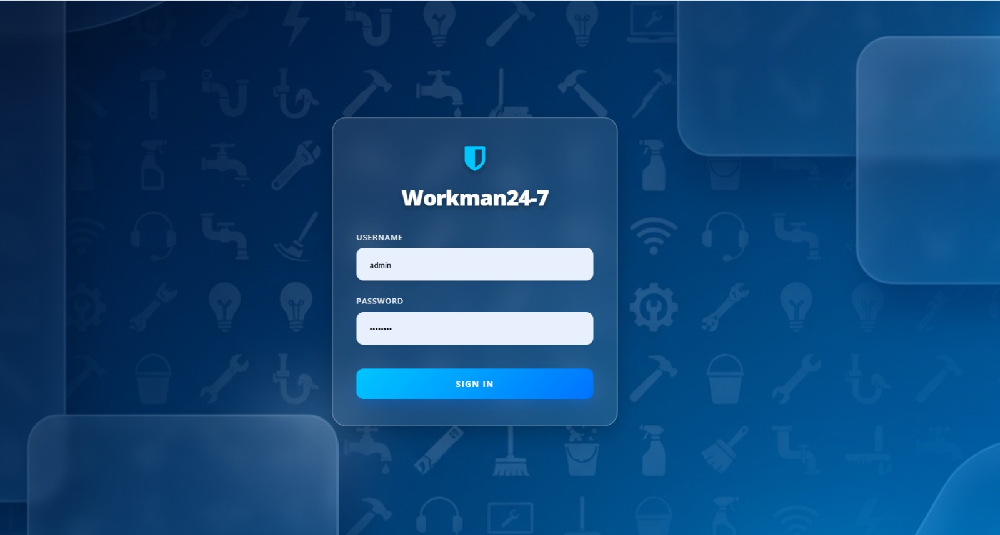
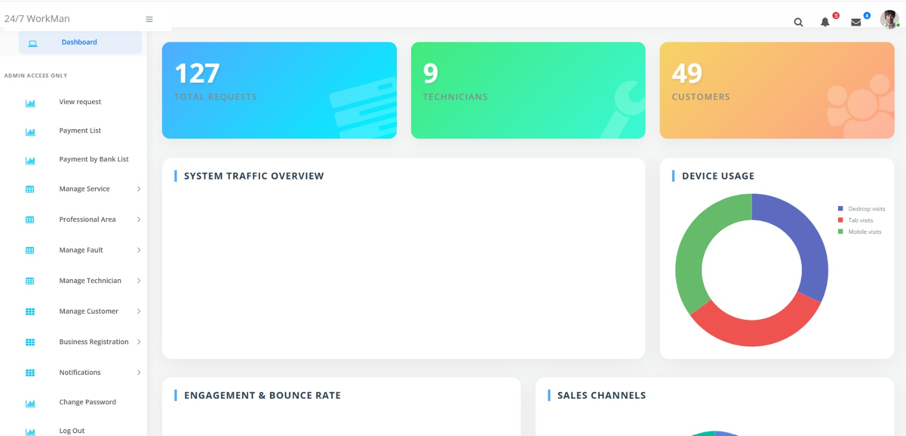
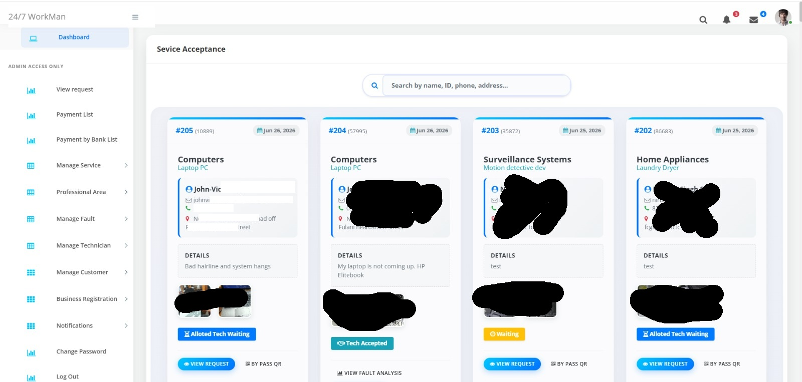

# 24/7 WorkMan App Admin Panel

Welcome to the **24/7 WorkMan App Admin Panel**. This is a premium web application dashboard designed for managing and coordinating technicians, service requests, customer accounts, business registrations, and payments for the 24/7 WorkMan on-demand service ecosystem.

The admin panel allows platform owners to oversee requests, manage service catalog offerings, verify service providers (technicians), manage clients, and process payments securely.

---

## 📸 Screen Previews

Here are some screenshots from the WorkMan Admin Panel:

### 1. Login Page
Security access page for authorized administrators to authenticate and access the control panel.



---

### 2. Dashboard
An overview dashboard containing key platform statistics, including requests, technicians, customers count, and recent activity.



---

### 3. Service Requests
An interface displaying all recent customer service requests. Administrators can see details, photos, and current job status.



---

### 4. Assign Job
A task allocation screen used by the administrator to dispatch a qualified technician to a specific service request.


---

## 🛠️ Main Features & Modules

The platform is divided into the following key management directories and modules:

### 📊 Dashboard & Monitoring
* **Platform Overview**: Displays total counts of pending/completed service requests, registered technicians, and active customers.
* **Map Tracking**: Integrating maps allows the admin to track locations for requests and technicians.

### 💼 Request & Job Management
* **Request Pipeline**: View customer-submitted requests, complete with descriptions, requested services, location, and uploaded photos of the faults.
* **Assign Job**: Allot available, verified technicians to specific requests based on category and professional area.
* **Bypass QR**: Allows the admin to bypass QR-code completion checks when needed to ensure manual overrides of service delivery.

### 👷 Technician Management
* **Technician Database**: Add, edit, list, and delete technicians.
* **Categorization**: Map technicians to specific professional areas (e.g. plumbing, electrical work, AC repair, cleaning).
* **Verify Status**: Activate or deactivate technician profiles.

### 👤 Customer & Business Management
* **Customer Control**: Track registered users, view request histories, and modify profiles.
* **Business Registration**: Manage registered sub-businesses, service partners, and vendors.

### 💰 Payment & Invoice Processing
* **Completed Payments**: Monitor overall service charges, fault analysis totals, and amounts paid.
* **Bank Payment Approvals**: Review and approve manual bank transfers/deposits submitted by customers or businesses.
* **Invoice Generation**: Auto-generate custom printable/exportable customer invoices containing detailed fault lists and service charges.

### 🔔 Notifications & Announcements
* **Send Notification**: Publish real-time global notifications to customers and technicians regarding app updates or announcements.
* **List Notifications**: Review history of sent push alerts and messages.

---

## ⚙️ Project Structure

Below is an overview of the primary file structure for the admin panel:
* **`index.php` / `admin_login.php`**: Admin login page.
* **`dashboard.php`**: Main dashboard containing overview statistics.
* **`header.php`**: Global navbar, menu options, and scripts loading.
* **`dbconfig.php`**: Database connection settings.
* **`class.php`**: The core PHP class containing the query methods for all modules.
* **`requrestviewdeatils.php` / `fetch_requests_ajax.php`**: Service request lists and AJAX handlers.
* **`generateinvoice.php`**: Document compiler for invoicing.
* **`assets/`**: Styles (CSS), Icons, and Javascript interactions.

---

## 🚀 Setup & Installation

To run this admin panel locally or on a production server:

1. **Requirements**:
   * PHP 7.4+ or 8.0+
   * MySQL / MariaDB Database Server
   * Apache or Nginx Web Server

2. **Configure Database**:
   * Create a database named `workman`.
   * Import the corresponding database schema (SQL file).
   * Open `dbconfig.php` and set your credentials:
     ```php
     define('DB_SERVER', 'localhost');
     define('DB_USERNAME', 'YOUR_DB_USER');
     define('DB_PASSWORD', 'YOUR_DB_PASS');
     define('DB_DATABASE', 'workman');
     ```

3. **Configure API Keys**:
   * Open `viewmap.php` and update the Google Maps JavaScript API script element with your actual developer key:
     ```html
     <script src="https://maps.googleapis.com/maps/api/js?key=YOUR_GOOGLE_MAPS_API_KEY&callback=myMap"></script>
     ```

4. **Upload files**:
   * Place the codebase inside your web root (e.g., `htdocs` or `/var/www/html`).
   * Make sure the `upload/` directory has write permissions (`chmod 755` or similar) to handle uploaded fault images.
